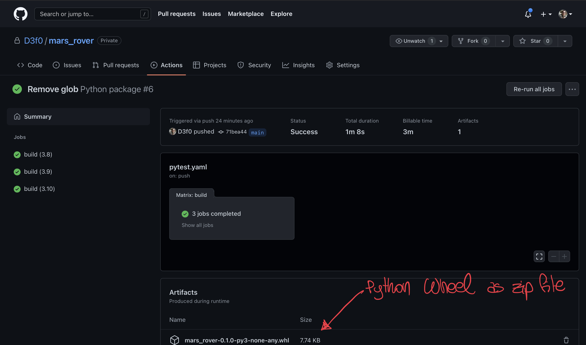
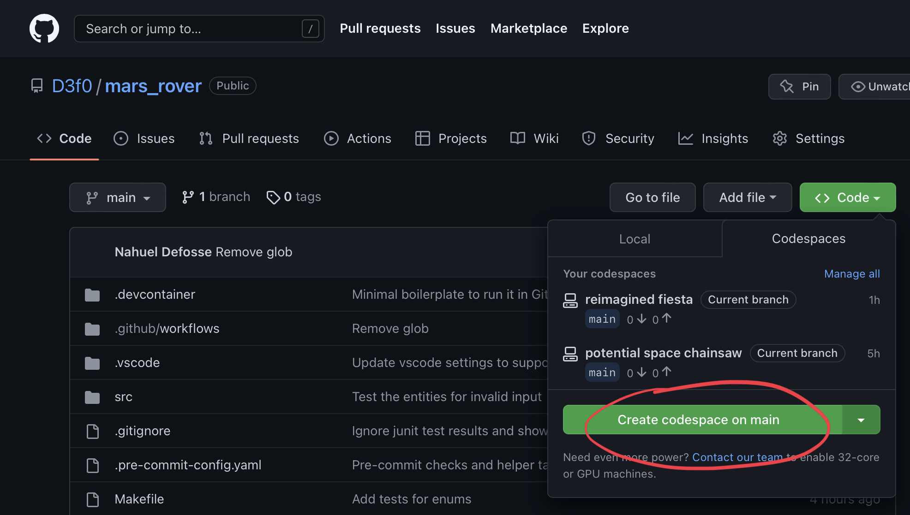

# Mars Rover

## Problem Statement

A squad of robotic rovers are to be landed by NASA on a plateau on Mars. This
plateau, which is flat and curiously rectangular, must be navigated by the
rovers so that their on-board cameras can get a complete view of the surrounding
terrain to send back to Earth. A rover's position and location are represented
by a combination of x and y co-ordinates and a letter representing one of the
four cardinal compass directions. The plateau is divided up into a grid to
simplify navigation. An example position might be 0, 0, N, which means the rover
is in the bottom left corner and facing North. In order to control a rover, NASA
sends a simple string of letters. The possible letters are `L`, `R` and `M`. `L`
and `R` makes the rover spin 90 degrees left or right respectively, without
moving from its current spot. 'M' means move forward one grid point, and
maintain the same heading. Assume that the square directly North from `(x, y)`
is `(x, y+1)`.

### Input

The first line of input is the upper-right coordinates of the plateau, the
lower-left coordinates are assumed to be `0, 0`. The rest of the input is
information pertaining to the rovers that have been deployed. Each rover has two
lines of input. The first line gives the rover's position, and the second line
is a series of instructions telling the rover how to explore the plateau. The
position is made up of two integers and a letter separated by spaces,
corresponding to the x and y co-ordinates and the rover's orientation. Each
rover will be finished sequentially, which means that the second rover won't
start to move until the first one has finished moving. The output for each rover
should be its final co-ordinates and heading.

Consider the following test input:

```text
5 5
1 2 N
LMLMLMLMM
3 3 E
MMRMMRMRRM
```

Here is the expected output:

```text
1 3 N
5 1 E
```

## Proposed Solution

* Python 3.8+
* Optional Dependencies (for Development and Testing)
  * Pytest 
  * Coverage
  * IPython

## How to run it

The project can be run with Python 3.8 and above. It doesn't require any external library.
Running the tests and packing it as a Python wheel require [poetry](https://python-poetry.org).

### Command Line Intraface

### Python interface

*Note that this approach requires some interactive shell like IPython*

Install the Python wheel, and run it from the terminal as follows:

```python
from mars_rover.entities import Plateau, Rover

p = Plateau(5, 5)
r = Rover(pos_x=0, pos_y=0, heading="N")
r.simulate("LLMM")
print(r)

```
### Installing the wheel 

Python wheels are the newest standard for Python distribution. Although this 
project is not published in Python official package idnex PyPI, the CI pipeline
produces wheels as artifacts. To grab the latest build

1. Go to Github Actions for the project [here](here)
2. Locate the zip compressed wheel at the bottom of the page.
    
3. Download the file and unzip it.
4. Install it with `python -m pip install path/to/`

### Adding the repo to your `sys.path`

This method is not recommended, but it's possible to add the folder contents
into the Python path.

```python

import sys
sys.path.append('path/to/mars_rover')
from mars_rover.cli import main
main()
```

### Using Github CodeSpaces

1. Locate Open Code Spaces in Github web UI
    